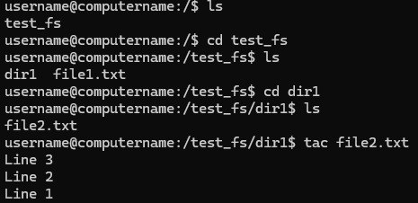
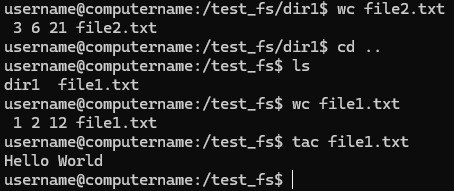
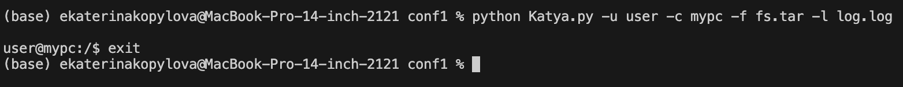

# Эмулятор оболочки ОС
## Общее описание
Этот проект представляет собой эмулятор оболочки операционной системы, написанный на Python. Программа предоставляет базовый интерфейс командной строки для работы с виртуальной файловой системой, хранящейся в архиве tar. Эмулятор поддерживает выполнение основных команд управления файлами и каталогами, таких как ls, cd, wc, tac, а также ведет логирование действий пользователя.

## Особенности
    1. Поддержка виртуальной файловой системы: Работа с файловой системой, упакованной в архив tar. 
    
    2. Эмуляция популярных команд:

      - ls — отображение содержимого каталога.

      - cd — навигация по каталогам.

      - wc — подсчет строк, слов и байт в файле.

      - tac — вывод содержимого файла в обратном порядке.

    3. Логирование: Все команды, введенные пользователем, записываются в лог-файл с указанием времени, имени пользователя и команды.

## Описание всех функций и настроек
### Функции:
    1. parse_arguments() - обрабатывает аргументы командной строки с помощью модуля argparse.

        * Параметры:

            - -u, --username: имя пользователя.

            - -c, --computername: имя компьютера.

            - -f, --fs: путь к архиву файловой системы.

            - -l, --logfile: путь к лог-файлу.

        * Возвращает: объект с параметрами для работы программы.

    2. load_filesystem(fs_path) - загружает архив tar, представляющий виртуальную файловую систему.

        * Параметры:

            - fs_path — путь к архиву.

        * Возвращает: объект tarfile для работы с содержимым архива.

        * Обрабатывает ошибки:

            - Файл не найден (FileNotFoundError).
            - Архив поврежден (tarfile.ReadError).

    3. log_action(logfile, user, action)

        * Записывает действия пользователя в лог-файл в формате JSON.

        * Параметры:

            - logfile: путь к лог-файлу.

            - user: имя пользователя.

            - action: выполненная команда.

    4. handle_ls(tar_fs, current_dir, options)

        * Выводит содержимое указанного каталога.

        * Параметры:

            - tar_fs: объект файловой системы.

            - current_dir: текущий каталог.

            - options: дополнительные параметры команды.

    5. handle_cd(tar_fs, current_dir, path)

        * Переходит в указанный каталог.

        * Параметры:

            - tar_fs: объект файловой системы.

            - current_dir: текущий каталог.

            - path: путь для перехода.

        * Возвращает: новый текущий каталог или сообщает об ошибке, если путь не существует.

    6. handle_wc(tar_fs, current_dir, filename)

        * Подсчитывает строки, слова и байты в указанном файле.

        * Параметры:

            - tar_fs: объект файловой системы.

            - current_dir: текущий каталог.

            - filename: имя файла.

    7. handle_tac(tar_fs, current_dir, filename)

        * Выводит содержимое файла в обратном порядке.

        * Параметры:

            - tar_fs: объект файловой системы.

            - current_dir: текущий каталог.

            - filename: имя файла.

    8. main()

        * Главная функция программы, реализующая основной цикл обработки команд пользователя.

        * Обеспечивает динамическое приглашение (username, computername, current_dir).

        * Обрабатывает команды ls, cd, wc, tac, а также завершение программы через exit.

## Описание команд для сборки проекта 

Для выполнения программы сборка не требуется. Достаточно наличия Python 3 и следующих шагов:

    1. Клонировать репозиторий или загрузить код.

    2. Убедиться, что файл filesystem.tar находится в доступной директории.

    3. Запустить программу с помощью команды:

```python
python emulator.py -u <имя_пользователя> -c <имя_компьютера> -f <путь_к_архиву> -l <путь_к_лог_файлу>
```

## Результаты прогона тестов





